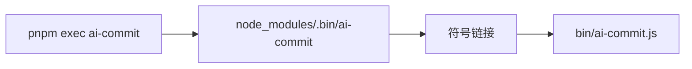

# 项目架构与运行机制

## 项目结构

```
node-ai-commit/
├── bin/
│   ├── ai-commit.js      # CLI 入口脚本
│   └── install.js        # 安装脚本
├── src/
│   ├── index.ts          # 导出入口
│   ├── ai.ts             # AI 服务适配器
│   ├── config.ts         # 配置加载
│   ├── git.ts            # Git 操作
│   ├── prompt.ts         # Prompt 构建
│   └── rc-config.ts      # RC 配置文件
├── package.json
└── README.md
```

## 入口点

**主入口**: [`bin/ai-commit.js`](bin/ai-commit.js)

这是项目的 CLI 入口文件，通过 `#!/usr/bin/env node` 声明为可执行脚本。

## 运行模式

### 1. Git Hook 模式（自动触发）

通过 `simple-git-hooks` 配置的 `prepare-commit-msg` hook：

```json
// package.json
{
  "simple-git-hooks": {
    "prepare-commit-msg": "node /path/to/bin/ai-commit.js"
  }
}
```

**触发流程**：

```
┌─────────────┐     git commit      ┌─────────────┐
│    User     │ ──────────────────► │    Git      │
└─────────────┘                     └─────────────┘
                                        │
                                        ▼
                              ┌─────────────────┐
                              │ prepare-commit-msg hook │
                              └─────────────────┘
                                        │
                    ┌───────────────────┼───────────────────┐
                    ▼                   ▼                   ▼
            git diff --cached   git rev-parse HEAD   git log -1
                    │                   │                   │
                    └───────────────────┴───────────────────┘
                                        │
                                        ▼
                              ┌─────────────────┐
                              │  构建 Prompt    │
                              └─────────────────┘
                                        │
                                        ▼
                              ┌─────────────────┐
                              │  调用 AI API    │
                              └─────────────────┘
                                        │
                                        ▼
                              ┌─────────────────┐
                              │ 写入 COMMIT_EDITMSG │
                              └─────────────────┘
```

### 2. CLI 手动模式

```bash
pnpm exec ai-commit --dry-run    # 预览不写入
pnpm exec ai-commit --verbose    # 调试模式
pnpm exec ai-commit setup        # 安装 git hooks
pnpm exec ai-commit --help       # 显示帮助
```

## 命令生效原理

### 本地 link 引入时命令如何生效

当其他项目通过以下方式引入时：

```json
// other-project/package.json
{
  "devDependencies": {
    "@light-cat/ai-commit-msg": "link:/Users/cain/Documents/code/node-ai-commit"
  }
}
```

**执行链路**：



**关键配置** (`package.json`):

```json
{
  "bin": {
    "ai-commit": "./bin/ai-commit.js"
  }
}
```

**安装过程**：

1. pnpm 解析 `link:` 协议，识别为本地源码
2. 创建符号链接：`node_modules/.bin/ai-commit` → `bin/ai-commit.js`
3. 执行 `pnpm exec ai-commit` 时，pnpm 查找 `node_modules/.bin/ai-commit`

**setup 命令流程** (`bin/ai-commit.js:42`):

```javascript
async function setupHooks() {
  // 1. 获取当前项目的 package.json 路径
  const projectRoot = process.cwd();
  const packageJsonPath = join(projectRoot, 'package.json');
  
  // 2. 获取 ai-commit.js 的绝对路径（关键！）
  const aiCommitPath = realpathSync(join(__dirname, 'ai-commit.js'));
  
  // 3. 更新 package.json 的 simple-git-hooks 配置
  packageJson['simple-git-hooks']['prepare-commit-msg'] = `node ${aiCommitPath}`;
  
  // 4. 安装 simple-git-hooks 并创建实际 hook 文件
  spawnSync('npx', ['simple-git-hooks'], { stdio: 'inherit' });
}
```

**生成的 hook 文件** (`.git/hooks/prepare-commit-msg`):

```bash
#!/bin/sh
node /Users/cain/Documents/code/node-ai-commit/bin/ai-commit.js "$@"
```

## AI Commit 实现原理

### 核心模块

| 模块 | 文件 | 职责 |
|------|------|------|
| **Git 操作** | [`src/git.ts`](src/git.ts:1) | 获取 diff、branch、lastCommit |
| **配置加载** | [`src/config.ts`](src/config.ts:1) | 从 `.env` 读取 API key |
| **Prompt 构建** | [`src/prompt.ts`](src/prompt.ts:1) | 组装中文/英文提示词 |
| **AI 调用** | [`src/ai.ts`](src/ai.ts:1) | 调用 OpenAI/DashScope API |

### 工作流程

1. **获取代码变更**：`git diff --cached` 获取暂存区 diff
2. **解析变更文件**：从 diff 中提取变更的文件列表
3. **构建 Prompt**：
   ```
   基于下面的 git diff 生成中文的提交信息：
   
   ## Git 信息
   - 分支：feature/auth
   
   ## 变更文件
   - src/auth.ts
   
   ## 代码差异
   ```diff
   +export function validateEmail(email: string): boolean {
   +  return /^[^\s@]+@[^\s@]+\.[^\s@]+$/.test(email);
   +}
   ```
   ```
4. **AI 生成**：调用 LLM 生成符合 Conventional Commits 格式的消息
5. **写入结果**：将生成的 message 写入 `.git/COMMIT_EDITMSG`

### 支持的 AI 提供商

| 提供商 | `AI_API_BASE_URL` | `AI_MODEL` |
|--------|-------------------|------------|
| OpenAI | `https://api.openai.com/v1` | `gpt-4`, `gpt-3.5-turbo` |
| Azure OpenAI | 你的 Azure endpoint | 你的部署名 |
| DashScope (Qwen) | `https://dashscope.aliyuncs.com/compatible-mode/v1` | `qwen-turbo`, `qwen-plus` |
| 本地/其他 | 自定义 endpoint | 任意 OpenAI 兼容模型 |

## 安全机制

- **错误不阻断**：AI 调用失败时正常退出，允许用户手动输入 message
- **已有 message 跳过**：检测到已存在 commit message 时不重复生成
- **Dry-run 模式**：`--dry-run` 参数支持预览生成的 message 而不写入

## 开发调试

```bash
# 直接运行源码（推荐）
pnpm tsx bin/ai-commit.js --help

# 构建后运行
pnpm build && node bin/ai-commit.js --help
```
